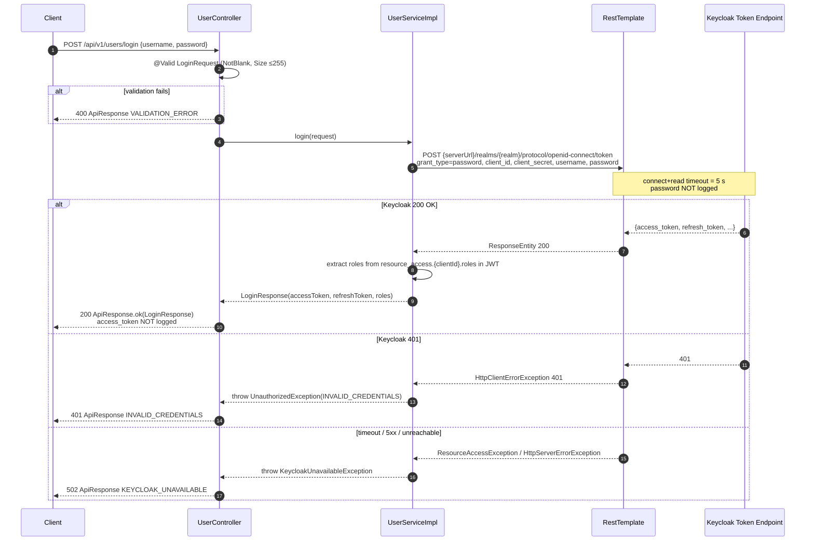
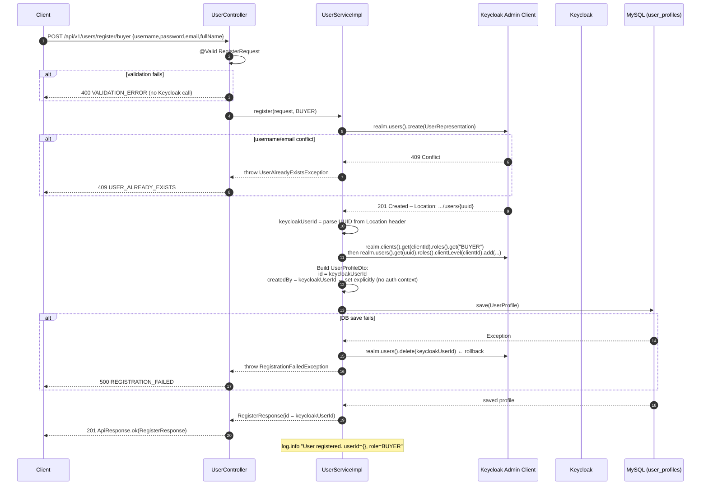

# Design Document – UserService

## Overview

UserService is a Spring Boot 3.4.4 microservice in the EasyTicket platform that acts as the bridge between client applications and Keycloak (the identity provider), while owning the internal `user_profiles` data store. It handles:

- **Authentication delegation** – accepts username/password, forwards a password-grant request to Keycloak, and returns tokens and roles to the caller.
- **User registration** – three flavors (buyer, organizer, admin): creates a Keycloak user via the Admin Client, assigns the correct client role, then persists a `UserProfile` whose primary key equals the Keycloak UUID.
- **Profile management** – GET and partial-PUT of the authenticated caller's own profile.
- **Cross-service aggregation** – retrieves purchased-ticket history from Order Service and organizer event statistics from Event Service via Feign clients.

UserService runs on port **8092** (AuthService uses 8091). It is an OAuth2 Resource Server that validates Keycloak-issued JWTs and exposes roles extracted from `resource_access.{client-id}.roles` as `ROLE_*` Spring Security authorities.

Key technology choices (all already decided):

| Concern | Choice |
|---|---|
| Language / runtime | Java 17, compile target 21 |
| Framework | Spring Boot 3.4.4 |
| Database | MySQL, `com.mysql.cj.jdbc.Driver` |
| ORM / auditing | Spring Data JPA + `@EnableJpaAuditing` |
| Security | Spring Security OAuth2 Resource Server + Keycloak JWT |
| Keycloak admin | `keycloak-admin-client` 26.0.4 |
| Schema migration | Liquibase 4.30.0, isolated module |
| HTTP clients | OpenFeign (downstream services), RestTemplate (Keycloak token endpoint) |
| Mapping | MapStruct 1.6.3 |
| Logging | SLF4J + Logback + `LogstashTcpSocketAppender` |
| Tracing | `micrometer-tracing-bridge-otel` + OTLP exporter |


---

## Architecture

### High-Level Component Diagram

```mermaid
graph TD
    Client([Client Application])

    subgraph UserService [UserService – port 8092]
        GEH[GlobalExceptionHandler<br/>@RestControllerAdvice]
        SC[SecurityConfig<br/>OAuth2 Resource Server]
        UC[UserController<br/>POST /login<br/>POST /register/*<br/>GET|PUT /me<br/>GET /me/ticket-history<br/>GET /me/organizer-history]
        US[UserService<br/>interface]
        USI[UserServiceImpl<br/>@Service]
        KCC[KeycloakConfig<br/>Admin Client bean]
        KCP[KeycloakConfigProperties]
        OSC[OrderServiceClient<br/>@FeignClient]
        ESC[EventServiceClient<br/>@FeignClient]
        UPR[UserProfileRepo<br/>interface / Port]
        UPRI[UserProfileRepositoryImpl<br/>Adapter @Repository]
        UPJPA[UserProfileRepository<br/>JpaRepository]
        UPE[UserProfile<br/>@Entity]
        BEnt[BaseEntity<br/>@MappedSuperclass]
        JC[JpaConfig<br/>@EnableJpaAuditing]
        LIQ[UserService-migration<br/>Liquibase]
    end

    KC([Keycloak])
    OS([Order Service])
    ES([Event Service])
    DB[(MySQL – user_profiles)]

    Client -->|HTTP| UC
    SC -->|validate JWT| KC
    UC --> US
    US --> USI
    USI -->|Admin Client| KCC
    KCC --> KC
    USI -->|token endpoint| KC
    USI --> UPR
    UPR --> UPRI
    UPRI --> UPJPA
    UPJPA --> DB
    UPE --> BEnt
    JC --> DB
    USI --> OSC
    USI --> ESC
    OSC -->|Feign| OS
    ESC -->|Feign| ES
    LIQ -->|run independently| DB
```

### Module Dependency Graph

```
UserService-application  ──depends on──►  UserService-business
UserService-application  ──depends on──►  UserService-infratructures
UserService-infratructures ──depends on──►  UserService-business
UserService-worker       ──depends on──►  UserService-business
UserService-worker       ──depends on──►  UserService-infratructures
UserService-migration    (standalone – no internal module dependencies)
UserService-common       (no internal module dependencies)
```

`business` does **not** depend on `infratructures`. Business defines port interfaces; infratructures provides adapters.


---

## Components and Interfaces

### Module: `UserService-application` (`com.easytickets.application`)

#### `Application.java`

```java
@SpringBootApplication
@ComponentScan(basePackages = {"com.easytickets"})
@EnableMethodSecurity
@EnableFeignClients(basePackages = "com.easytickets")
public class Application { public static void main(String[] args) { ... } }
```

#### `SecurityConfig.java`

Mirrors the AuthService pattern exactly. Loads `SecurityProperties` (permit list from `url.permit`) via `@ConfigurationProperties`. Installs `CustomJwtAuthenticationConverter` as the JWT converter for the OAuth2 Resource Server filter chain.

```
Permitted without token (application.yaml):
  POST  /api/v1/users/login
  POST  /api/v1/users/register/buyer
  POST  /api/v1/users/register/organizer
  GET   /actuator/health
All other requests require a valid JWT.
```

#### `CustomJwtAuthenticationConverter.java`

Reads `resource_access.{client-id}.roles` from the JWT claim map, prefixes each with `ROLE_`, and returns a `JwtAuthenticationToken`. The `client-id` is injected from `KeycloakConfigProperties`.

#### `SecurityProperties.java`

`@ConfigurationProperties(prefix = "url")` holding `List<ApiPath> permit`, where each `ApiPath` has `path` and `List<String> methods`.

#### `GlobalExceptionHandler.java`

`@RestControllerAdvice` in `com.easytickets.application.exception`. Handles:

| Exception | HTTP Status | errorCode |
|---|---|---|
| `MethodArgumentNotValidException` | 400 | `VALIDATION_ERROR` |
| `BusinessException` | from exception | from exception |
| `Exception` (fallback) | 500 | `INTERNAL_SERVER_ERROR` |

Populates `traceId` from MDC (`TraceContext`). Never includes stack trace in response body.

#### `UserController.java`

`@RestController @RequestMapping("api/v1/users")`. All methods return `ResponseEntity<ApiResponse<T>>`.

| Method | Path | Auth | Role | Description |
|---|---|---|---|---|
| POST | `/login` | ✗ | — | Delegate password grant to Keycloak |
| POST | `/register/buyer` | ✗ | — | Self-service buyer registration |
| POST | `/register/organizer` | ✗ | — | Self-service organizer registration |
| POST | `/register/admin` | ✓ | `ADMIN` | Admin-only admin registration |
| GET | `/me` | ✓ | — | Return own profile |
| PUT | `/me` | ✓ | — | Partial update own profile |
| GET | `/me/ticket-history` | ✓ | — | Delegate to Order Service |
| GET | `/me/organizer-history` | ✓ | `ORGANIZER` | Delegate to Event Service |

`POST /register/admin` is annotated `@PreAuthorize("hasRole('ADMIN')")`.
`GET /me/organizer-history` is annotated `@PreAuthorize("hasRole('ORGANIZER')")`.


### Module: `UserService-business` (`com.easytickets.business`)

#### `KeycloakConfigProperties.java`

```java
@Configuration
@ConfigurationProperties(prefix = "keycloak")
@Getter @Setter
public class KeycloakConfigProperties {
    private String serverUrl;
    private String realm;
    private String clientId;
    private String clientSecret;
}
```

#### `KeycloakConfig.java`

```java
@Configuration @RequiredArgsConstructor
public class KeycloakConfig {
    private final KeycloakConfigProperties config;
    @Bean
    public Keycloak keycloak() {
        return KeycloakBuilder.builder()
            .serverUrl(config.getServerUrl()).realm(config.getRealm())
            .clientId(config.getClientId()).clientSecret(config.getClientSecret())
            .grantType(OAuth2Constants.CLIENT_CREDENTIALS).build();
    }
    @Bean
    public RestTemplate keycloakRestTemplate() {
        // 5s connect + 5s read timeout, ObservationRestTemplateCustomizer for trace propagation
        SimpleClientHttpRequestFactory factory = new SimpleClientHttpRequestFactory();
        factory.setConnectTimeout(5000);
        factory.setReadTimeout(5000);
        return new RestTemplate(factory);
    }
}
```

#### `UserService.java` (interface)

```
interface UserService {
    LoginResponse login(LoginRequest request);
    RegisterResponse register(RegisterRequest request, UserRole role);
    UserProfileResponse getMyProfile(String keycloakUserId);
    UserProfileResponse updateMyProfile(String keycloakUserId, UpdateProfileRequest request);
    Object getTicketHistory(String keycloakUserId, int page, int size);
    Object getOrganizerHistory(String keycloakUserId);
}
```

#### `UserServiceImpl.java`

Core business logic. Dependencies: `Keycloak` admin client, `KeycloakConfigProperties`, `RestTemplate` (token endpoint), `UserProfileRepo` (port), `OrderServiceClient`, `EventServiceClient`.

Key responsibilities:
- Build and execute the Keycloak token endpoint call via `RestTemplate`.
- Create Keycloak users and assign roles via Admin Client.
- Extract Keycloak UUID from the `Location` header response.
- For self-service registrations, manually set `createdBy = keycloakUUID` on the entity before saving (bypassing the `AuditorAware` which would return empty in a no-auth context).
- On DB save failure, call `keycloak.realm(realm).users().delete(userId)` to rollback.
- Throw `BusinessException` subclasses for all error conditions (never raw `RuntimeException`).

#### `UserProfileRepo.java` (Port interface)

```
interface UserProfileRepo {
    UserProfileDto save(UserProfileDto profile);
    Optional<UserProfileDto> findActiveById(String id);
    UserProfileDto update(UserProfileDto profile);
}
```

Only DTO types cross the boundary — no JPA entities.

#### DTOs in `com.easytickets.business.dto`

| Class | Purpose |
|---|---|
| `LoginRequest` | `@NotBlank username` (1-255), `@NotBlank password` (1-255) |
| `LoginResponse` | `accessToken`, `refreshToken`, `List<String> roles` |
| `RegisterRequest` | `username` (3-50), `password` (8-128), `email` (valid, 1-255), `fullName` (1-100) |
| `RegisterResponse` | `id` (created profile UUID) |
| `UserProfileDto` | Internal transfer between service and repo |
| `UserProfileResponse` | `id`, `fullName`, `phone`, `avatarUrl`, `address` |
| `UpdateProfileRequest` | `@Size` validated: `fullName` (1-100), `phone` (≤20), `avatarUrl` (≤255), `address` (≤255) |

#### Exception types in `com.easytickets.business.exception`

```
BusinessException (base)
├── ValidationException          – 400, VALIDATION_ERROR
├── UnauthorizedException        – 401, INVALID_CREDENTIALS / INVALID_TOKEN
├── ForbiddenException           – 403, FORBIDDEN
├── ProfileNotFoundException     – 404, PROFILE_NOT_FOUND
├── UserAlreadyExistsException   – 409, USER_ALREADY_EXISTS
├── RegistrationFailedException  – 500, REGISTRATION_FAILED
├── KeycloakUnavailableException – 502, KEYCLOAK_UNAVAILABLE
├── OrderServiceUnavailableException  – 502, ORDER_SERVICE_UNAVAILABLE
└── EventServiceUnavailableException  – 502, EVENT_SERVICE_UNAVAILABLE
```

#### Feign Clients in `com.easytickets.business.client`

```java
@FeignClient(name = "order-service", url = "${services.order-service.url}",
             configuration = FeignClientConfig.class)
public interface OrderServiceClient {
    @GetMapping("/api/v1/orders/my-tickets")
    ApiResponse<Object> getMyTickets(
        @RequestHeader("Authorization") String authorizationHeader,
        @RequestParam int page,
        @RequestParam int size);
}

@FeignClient(name = "event-service", url = "${services.event-service.url}",
             configuration = FeignClientConfig.class)
public interface EventServiceClient {
    @GetMapping("/api/v1/events/organizer-history")
    ApiResponse<Object> getOrganizerHistory(
        @RequestHeader("Authorization") String authorizationHeader);
}
```

`FeignClientConfig` sets connect timeout 5 s and read timeout 5 s. `FeignException` is caught in `UserServiceImpl` and wrapped into the appropriate `*ServiceUnavailableException`.


### Module: `UserService-infratructures` (`com.easytickets.infratructures`)

#### `BaseEntity.java` – `com.easytickets.infratructures.model`

```java
@MappedSuperclass
@Data
@EntityListeners(AuditingEntityListener.class)
public abstract class BaseEntity {
    @Id
    @GeneratedValue(strategy = GenerationType.UUID)
    private String id;

    @Enumerated(EnumType.STRING)
    @Column(name = "delete_flag", nullable = false)
    private RecordStatus deleteFlag = RecordStatus.ACTIVE;

    @CreatedBy
    @Column(name = "created_by", updatable = false)
    private String createdBy;

    @CreatedDate
    @Column(name = "created_at", updatable = false)
    private LocalDateTime createdAt;

    @LastModifiedBy
    @Column(name = "updated_by")
    private String updatedBy;

    @LastModifiedDate
    @Column(name = "updated_at")
    private LocalDateTime updatedAt;
}
```

#### `RecordStatus.java`

```java
public enum RecordStatus { ACTIVE, DELETED }
```

#### `UserProfile.java` – `com.easytickets.infratructures.model`

`UserProfile` extends `BaseEntity` but **overrides** the `@Id` field to disable `@GeneratedValue` — the id is assigned explicitly to the Keycloak UUID before persistence.

```java
@Entity
@Table(name = "user_profiles")
@Where(clause = "delete_flag = 'ACTIVE'")
@Data
@EqualsAndHashCode(callSuper = true)
@EntityListeners(AuditingEntityListener.class)
public class UserProfile extends BaseEntity {

    // Override to suppress @GeneratedValue — id is set explicitly from Keycloak UUID
    @Id
    @Column(name = "id", length = 36, nullable = false)
    private String id;

    @Column(name = "full_name", length = 100, nullable = false)
    private String fullName;

    @Column(name = "phone", length = 20)
    private String phone;

    @Column(name = "avatar_url", length = 255)
    private String avatarUrl;

    @Column(name = "address", length = 255)
    private String address;
}
```

The `@Where` annotation ensures Hibernate automatically appends `delete_flag = 'ACTIVE'` to every query, satisfying Requirements 9.7–9.10 transparently.

#### `JpaConfig.java`

```java
@Configuration
@EnableJpaAuditing(auditorAwareRef = "auditorProvider")
@EnableJpaRepositories(basePackages = {"com.easytickets"})
@EntityScan(basePackages = {"com.easytickets"})
public class JpaConfig {
    @Bean
    public AuditorAware<String> auditorProvider() {
        return () -> Optional.ofNullable(SecurityContextHolder.getContext().getAuthentication())
            .filter(Authentication::isAuthenticated)
            .map(auth -> {
                if (auth.getPrincipal() instanceof Jwt jwt) return jwt.getSubject();
                return auth.getName();
            });
    }
}
```

When no authentication context exists (self-service registration), `AuditorAware` returns `Optional.empty()` so `createdBy` is not populated by the framework. `UserServiceImpl` sets `createdBy` explicitly to the Keycloak UUID before calling `save()`.

#### `UserProfileRepository.java`

```java
public interface UserProfileRepository extends JpaRepository<UserProfile, String> {
    // @Where on entity already filters DELETED rows
    Optional<UserProfile> findById(String id);
}
```

#### `UserProfileRepositoryImpl.java` – `com.easytickets.infratructures.shared`

Adapter implementing `UserProfileRepo` from the business port. Uses `UserProfileRepository` (JPA) and `UserProfileMapper` (MapStruct) to translate between DTO and entity.

```java
@Repository @RequiredArgsConstructor
public class UserProfileRepositoryImpl implements UserProfileRepo {
    private final UserProfileRepository jpaRepository;
    private final UserProfileMapper mapper;

    @Override public UserProfileDto save(UserProfileDto dto) {
        UserProfile entity = mapper.toEntity(dto);
        return mapper.toDto(jpaRepository.save(entity));
    }
    @Override public Optional<UserProfileDto> findActiveById(String id) {
        return jpaRepository.findById(id).map(mapper::toDto);
    }
    @Override public UserProfileDto update(UserProfileDto dto) {
        UserProfile entity = jpaRepository.findById(dto.getId())
            .orElseThrow(() -> new ProfileNotFoundException(...));
        mapper.updateEntityFromDto(dto, entity);
        return mapper.toDto(jpaRepository.save(entity));
    }
}
```

#### `UserProfileMapper.java`

`@Mapper(componentModel = "spring")`. Methods: `toDto`, `toEntity`, `updateEntityFromDto` (for partial update — MapStruct `@BeanMapping(nullValuePropertyMappingStrategy = NullValuePropertyMappingStrategy.IGNORE)`).


### Module: `UserService-common` (`com.easytickets.common`)

Shared types with no internal module dependencies.

| Class | Package | Purpose |
|---|---|---|
| `ApiResponse<T>` | `com.easytickets.common.dto` | Standard HTTP response envelope: `success`, `errorCode`, `message`, `data`, `traceId` |
| `AppConstants` | `com.easytickets.common.constant` | Error code string constants (`VALIDATION_ERROR`, `INVALID_CREDENTIALS`, etc.) |

`ApiResponse<T>` static factories:
- `ApiResponse.ok(T data)` → `success=true, errorCode=null`
- `ApiResponse.ok(T data, String message)` → same with message
- `ApiResponse.error(String errorCode, String message)` → `success=false, data=null`

`traceId` is populated in `GlobalExceptionHandler` and controller advice from MDC key `traceId` (injected automatically by `micrometer-tracing`). If MDC is empty, `traceId` is set to `""` (empty string, never null).

### Module: `UserService-migration`

Standalone Spring Boot application. No business logic. Dependencies: `spring-boot-starter-data-jpa`, `spring-boot-starter-web`, `mysql-connector-j`, `liquibase-core`, `lombok`.

File layout:
```
UserService-migration/src/main/resources/
├── application.yaml
└── db/
    ├── changelog/
    │   └── changelog.xml
    └── sources/
        └── V1_202506280000_create_user_profiles_table.sql
```

### Module: `UserService-worker` (`com.easytickets.worker`)

Reserved for future Kafka consumers/producers and scheduled jobs. No Kafka consumers are required for the current feature set. The module exists to maintain structural conformance.


---

## Data Models

### `user_profiles` Table (DDL)

```sql
CREATE TABLE user_profiles (
    id          CHAR(36)                       NOT NULL DEFAULT (UUID()),
    full_name   VARCHAR(100)                   NOT NULL,
    phone       VARCHAR(20)                    NULL,
    avatar_url  VARCHAR(255)                   NULL,
    address     VARCHAR(255)                   NULL,
    delete_flag ENUM('ACTIVE', 'DELETED')      NOT NULL DEFAULT 'ACTIVE',
    created_by  VARCHAR(255)                   NULL,
    created_at  TIMESTAMP                      NULL,
    updated_by  VARCHAR(255)                   NULL,
    updated_at  TIMESTAMP                      NULL,
    PRIMARY KEY (id)
) ENGINE=InnoDB DEFAULT CHARSET=utf8mb4 COLLATE=utf8mb4_unicode_ci;
```

**Note on `id`:** The column has `DEFAULT (UUID())` as a MySQL safety net, but JPA will always supply the value explicitly (set from the Keycloak user UUID extracted from the `Location` header). `@GeneratedValue` is suppressed on `UserProfile.id`.

**Note on `created_by` / `updated_by`:** Store only the Keycloak User UUID (JWT `sub` claim), never username or email.

### Entity Class Hierarchy

```
BaseEntity (@MappedSuperclass)
└── UserProfile (@Entity, @Table("user_profiles"), @Where("delete_flag = 'ACTIVE'"))
```

### DTOs

```
LoginRequest          { username: String, password: String }
LoginResponse         { accessToken: String, refreshToken: String, roles: List<String> }
RegisterRequest       { username: String, password: String, email: String, fullName: String }
RegisterResponse      { id: String }
UserProfileResponse   { id, fullName, phone, avatarUrl, address }
UpdateProfileRequest  { fullName?, phone?, avatarUrl?, address? }  -- all optional
UserProfileDto        { id, fullName, phone, avatarUrl, address,
                        deleteFlag, createdBy, createdAt, updatedBy, updatedAt }
```

### Bean Validation Constraints Summary

| Field | Constraint | Error |
|---|---|---|
| `LoginRequest.username` | `@NotBlank`, `@Size(max=255)` | `VALIDATION_ERROR` |
| `LoginRequest.password` | `@NotBlank`, `@Size(max=255)` | `VALIDATION_ERROR` |
| `RegisterRequest.username` | `@NotBlank`, `@Size(min=3, max=50)` | `VALIDATION_ERROR` |
| `RegisterRequest.password` | `@NotBlank`, `@Size(min=8, max=128)` | `VALIDATION_ERROR` |
| `RegisterRequest.email` | `@NotBlank`, `@Email`, `@Size(max=255)` | `VALIDATION_ERROR` |
| `RegisterRequest.fullName` | `@NotBlank`, `@Size(min=1, max=100)` | `VALIDATION_ERROR` |
| `UpdateProfileRequest.fullName` | `@Size(min=1, max=100)` (if present) | `VALIDATION_ERROR` |
| `UpdateProfileRequest.phone` | `@Size(max=20)` (if present) | `VALIDATION_ERROR` |
| `UpdateProfileRequest.avatarUrl` | `@Size(max=255)` (if present) | `VALIDATION_ERROR` |
| `UpdateProfileRequest.address` | `@Size(max=255)` (if present) | `VALIDATION_ERROR` |


---

## Sequence Diagrams

### Login Flow



### Registration Flow (Buyer / Organizer – self-service)



### Admin Registration Flow

Same as buyer/organizer registration except:
1. `@PreAuthorize("hasRole('ADMIN')")` enforced by Spring Security before the controller method executes → 401 (no token) or 403 (wrong role) returned before reaching business logic.
2. `createdBy` is populated automatically by `AuditorAware` (JWT sub from authenticated context) — not set manually.
3. Assigned role is `ADMIN`.


---

## Configuration Structure

### `UserService-application/src/main/resources/application.yaml`

```yaml
spring:
  application:
    name: UserService-application
  datasource:
    url: ${DB_URL:jdbc:mysql://localhost:3306/user_service_db}
    username: ${DB_USERNAME:root}
    password: ${DB_PASSWORD:password}
    driver-class-name: com.mysql.cj.jdbc.Driver
  jpa:
    properties:
      hibernate:
        show_sql: false
  liquibase:
    enabled: false           # migrations run via isolated migration module
  security:
    oauth2:
      resourceserver:
        jwt:
          jwk-set-uri: ${KEYCLOAK_JWK_URI:http://localhost:8080/realms/easyticket/protocol/openid-connect/certs}

server:
  port: ${SERVER_PORT:8092}

keycloak:
  realm: ${KEYCLOAK_REALM:easyticket}
  server-url: ${KEYCLOAK_SERVER_URL:http://localhost:8080}
  client-id: ${KEYCLOAK_CLIENT_ID:user-service-client}
  client-secret: ${KEYCLOAK_CLIENT_SECRET:changeme}

services:
  order-service:
    url: ${ORDER_SERVICE_URL:http://order-service:8093}
  event-service:
    url: ${EVENT_SERVICE_URL:http://event-service:8094}

feign:
  client:
    config:
      default:
        connect-timeout: 5000
        read-timeout: 5000

management:
  tracing:
    sampling:
      probability: ${TRACING_SAMPLING:1.0}
  otlp:
    tracing:
      endpoint: ${OTEL_EXPORTER_OTLP_ENDPOINT:http://otel-collector:4318/v1/traces}
    metrics:
      export:
        url: ${OTEL_METRICS_ENDPOINT:http://otel-collector:4318/v1/metrics}
  metrics:
    export:
      prometheus:
        enabled: true
  endpoints:
    web:
      exposure:
        include: health,info,metrics,prometheus

logging:
  level:
    root: INFO
    com.easytickets: DEBUG
    org.hibernate.SQL: DEBUG
  pattern:
    console: "%d{yyyy-MM-dd HH:mm:ss.SSS} [%thread] [%X{traceId},%X{spanId}] %-5level %logger{36} - %msg%n"

url:
  permit:
    - path: "/api/v1/users/login"
      methods: ["POST"]
    - path: "/api/v1/users/register/buyer"
      methods: ["POST"]
    - path: "/api/v1/users/register/organizer"
      methods: ["POST"]
    - path: "/actuator/health"
      methods: ["GET"]
```

### `UserService-migration/src/main/resources/application.yaml`

```yaml
spring:
  application:
    name: UserService-migration
  datasource:
    url: ${DB_URL:jdbc:mysql://localhost:3306/user_service_db}
    username: ${DB_USERNAME:root}
    password: ${DB_PASSWORD:password}
    driver-class-name: com.mysql.cj.jdbc.Driver
  liquibase:
    enabled: true
    change-log: classpath:db/changelog/changelog.xml
  jpa:
    hibernate:
      ddl-auto: none
```

### `UserService-migration/src/main/resources/db/changelog/changelog.xml`

```xml
<databaseChangeLog xmlns="http://www.liquibase.org/xml/ns/dbchangelog"
    xmlns:xsi="http://www.w3.org/2001/XMLSchema-instance"
    xsi:schemaLocation="http://www.liquibase.org/xml/ns/dbchangelog
        http://www.liquibase.org/xml/ns/dbchangelog/dbchangelog-3.8.xsd">

    <changeSet author="dev.team" id="V1_202506280000_create_user_profiles_table"
               onValidationFail="MARK_RAN">
        <sqlFile dbms="mysql"
                 path="classpath:/db/sources/V1_202506280000_create_user_profiles_table.sql"
                 relativeToChangelogFile="false"/>
    </changeSet>

</databaseChangeLog>
```

### `V1_202506280000_create_user_profiles_table.sql`

Path: `UserService-migration/src/main/resources/db/sources/V1_202506280000_create_user_profiles_table.sql`

```sql
CREATE TABLE user_profiles (
    id          CHAR(36)                       NOT NULL DEFAULT (UUID()),
    full_name   VARCHAR(100)                   NOT NULL,
    phone       VARCHAR(20)                    NULL,
    avatar_url  VARCHAR(255)                   NULL,
    address     VARCHAR(255)                   NULL,
    delete_flag ENUM('ACTIVE', 'DELETED')      NOT NULL DEFAULT 'ACTIVE',
    created_by  VARCHAR(255)                   NULL,
    created_at  TIMESTAMP                      NULL,
    updated_by  VARCHAR(255)                   NULL,
    updated_at  TIMESTAMP                      NULL,
    PRIMARY KEY (id)
) ENGINE=InnoDB DEFAULT CHARSET=utf8mb4 COLLATE=utf8mb4_unicode_ci;
```


### `logback-spring.xml`

Located in `UserService-application/src/main/resources/logback-spring.xml`.

```xml
<?xml version="1.0" encoding="UTF-8"?>
<configuration>
    <appender name="CONSOLE" class="ch.qos.logback.core.ConsoleAppender">
        <encoder>
            <pattern>%d{yyyy-MM-dd HH:mm:ss.SSS} [%thread] [%X{traceId},%X{spanId}] %-5level %logger{36} - %msg%n</pattern>
        </encoder>
    </appender>

    <appender name="LOGSTASH" class="net.logstash.logback.appender.LogstashTcpSocketAppender">
        <destination>${LOGSTASH_HOST:-logstash}:${LOGSTASH_PORT:-5000}</destination>
        <encoder class="net.logstash.logback.encoder.LogstashEncoder">
            <includeMdcKeyName>traceId</includeMdcKeyName>
            <includeMdcKeyName>spanId</includeMdcKeyName>
            <customFields>{"service":"UserService-application"}</customFields>
        </encoder>
        <keepAliveDuration>5 minutes</keepAliveDuration>
    </appender>

    <root level="INFO">
        <appender-ref ref="CONSOLE"/>
        <appender-ref ref="LOGSTASH"/>
    </root>

    <logger name="com.easytickets" level="DEBUG"/>
    <logger name="org.hibernate.SQL" level="DEBUG"/>
</configuration>
```

---

## Maven Module POMs – Key Design Points

### Parent POM (`UserService/pom.xml`)

- `<groupId>com.easytickets</groupId>`, `<artifactId>UserService</artifactId>`, `<packaging>pom</packaging>`
- Declares all 6 modules.
- `<properties>`: `java.version=17`, `mapstruct.version=1.6.3`, `liquibase.version=4.30.0`, `keycloak.version=26.0.4`, `lombok.version=1.18.30`, `spring-boot.version=3.4.4`.
- `<dependencyManagement>` manages versions for all shared dependencies.
- `<build><pluginManagement>` configures `maven-compiler-plugin` with `source=17`, `target=21`, and annotation processor paths for Lombok + MapStruct + `lombok-mapstruct-binding`.

### Module Dependency Matrix

| Module POM | depends on (internal) |
|---|---|
| `UserService-application` | `UserService-business`, `UserService-infratructures` |
| `UserService-business` | `UserService-common` |
| `UserService-infratructures` | `UserService-business` |
| `UserService-worker` | `UserService-business`, `UserService-infratructures` |
| `UserService-migration` | *(none)* |
| `UserService-common` | *(none)* |

### Key Runtime Dependencies Per Module

**application**: `spring-boot-starter-web`, `spring-boot-starter-oauth2-resource-server`, `spring-security-core`, `spring-cloud-starter-openfeign`, `micrometer-tracing-bridge-otel`, `opentelemetry-exporter-otlp`, `micrometer-registry-prometheus`, `logstash-logback-encoder`

**business**: `keycloak-admin-client`, `spring-boot-starter-web` (for RestTemplate), `hibernate-validator`, `lombok`, `mapstruct`

**infratructures**: `spring-boot-starter-data-jpa`, `mysql-connector-j` (runtime), `lombok`, `mapstruct`

**common**: `lombok`

**migration**: `spring-boot-starter-data-jpa`, `spring-boot-starter-web`, `mysql-connector-j` (runtime), `liquibase-core`, `lombok`

**worker**: `spring-kafka` (when needed), `lombok`


---

## Package Structure (Full)

```
com.easytickets.application
├── Application.java
├── config/
│   ├── CustomJwtAuthenticationConverter.java
│   ├── SecurityConfig.java
│   └── SecurityProperties.java
├── controller/
│   └── UserController.java
├── dto/
│   └── response/
│       └── (ApiResponse lives in common)
├── exception/
│   └── GlobalExceptionHandler.java
└── mapper/
    └── (application-layer mappers if needed)

com.easytickets.business
├── client/
│   ├── EventServiceClient.java
│   ├── FeignClientConfig.java
│   └── OrderServiceClient.java
├── config/
│   ├── KeycloakConfig.java
│   └── KeycloakConfigProperties.java
├── dto/
│   ├── LoginRequest.java
│   ├── LoginResponse.java
│   ├── RegisterRequest.java
│   ├── RegisterResponse.java
│   ├── UpdateProfileRequest.java
│   ├── UserProfileDto.java
│   └── UserProfileResponse.java
├── exception/
│   ├── BusinessException.java
│   ├── EventServiceUnavailableException.java
│   ├── ForbiddenException.java
│   ├── KeycloakUnavailableException.java
│   ├── OrderServiceUnavailableException.java
│   ├── ProfileNotFoundException.java
│   ├── RegistrationFailedException.java
│   ├── UnauthorizedException.java
│   ├── UserAlreadyExistsException.java
│   └── ValidationException.java
├── repo/
│   └── UserProfileRepo.java
└── services/
    ├── UserService.java
    └── impl/
        └── UserServiceImpl.java

com.easytickets.infratructures
├── config/
│   └── JpaConfig.java
├── mapper/
│   └── UserProfileMapper.java
├── model/
│   ├── BaseEntity.java
│   ├── RecordStatus.java
│   └── UserProfile.java
├── repo/
│   └── UserProfileRepository.java
└── shared/
    └── UserProfileRepositoryImpl.java

com.easytickets.common
├── constant/
│   └── AppConstants.java
├── dto/
│   └── ApiResponse.java
└── enums/
    (shared enums if required)

com.easytickets.worker
└── (reserved – empty for current scope)
```


---

## Correctness Properties

*A property is a characteristic or behavior that should hold true across all valid executions of a system — essentially, a formal statement about what the system should do. Properties serve as the bridge between human-readable specifications and machine-verifiable correctness guarantees.*

### Property 1: Login Validation Rejection

*For any* login request in which at least one of `username` or `password` is null, blank, composed entirely of whitespace, or exceeds 255 characters, the endpoint SHALL return HTTP 400 with errorCode `VALIDATION_ERROR`, and the Keycloak token endpoint SHALL NOT be called.

**Validates: Requirements 1.4, 1.8**

---

### Property 2: Login Response Mapping Fidelity

*For any* successful Keycloak token response containing an `access_token`, a `refresh_token`, and a list of roles extracted from `resource_access.{clientId}.roles`, the `LoginResponse` returned by `UserServiceImpl.login()` SHALL contain exactly those same token values and the same set of role strings.

**Validates: Requirements 1.3**

---

### Property 3: Registration – Keycloak User Created with Correct Role

*For any* valid registration request (username 3–50 chars, password 8–128 chars, valid email, full name 1–100 chars) for any registration type (buyer, organizer, admin), the Keycloak Admin Client SHALL be called to create a user with the submitted username and email, and the corresponding client role (BUYER, ORGANIZER, or ADMIN respectively) SHALL be assigned to that user before profile persistence.

**Validates: Requirements 2.2, 2.3, 3.2, 3.3, 4.6, 4.7**

---

### Property 4: Registration – UserProfile id Equals Keycloak UUID

*For any* valid registration that successfully creates a Keycloak user, the persisted `UserProfile.id` SHALL equal the Keycloak user UUID extracted from the `Location` header of the Keycloak create-user response, and `UserProfile.full_name` SHALL equal the submitted `fullName` field.

**Validates: Requirements 2.4, 3.4, 4.7, 9.3**

---

### Property 5: Registration Validation – No Keycloak Call for Invalid Input

*For any* registration request in which at least one field fails its validation constraint (username outside 3–50, password outside 8–128, malformed email, full name outside 1–100, or any required field absent), the endpoint SHALL return HTTP 400 with errorCode `VALIDATION_ERROR`, and the Keycloak Admin Client SHALL NOT be invoked.

**Validates: Requirements 2.6, 3.6, 4.5**

---

### Property 6: Registration Rollback on DB Failure

*For any* registration where the Keycloak user is created successfully but the subsequent `UserProfile` persistence throws any exception, the Keycloak user SHALL be deleted or disabled (rollback), and the response SHALL have HTTP status 500 with errorCode `REGISTRATION_FAILED`. No partial account shall remain usable.

**Validates: Requirements 2.8, 3.8, 4.10**

---

### Property 7: Profile Lookup Returns All Active Fields

*For any* `UserProfile` record that exists in the database with `delete_flag = ACTIVE`, a `GET /api/v1/users/me` request whose JWT `sub` equals that profile's `id` SHALL return HTTP 200 with `success = true` and a `data` object whose `id`, `fullName`, `phone`, `avatarUrl`, and `address` fields equal the stored values (absent optional fields represented as null).

**Validates: Requirements 5.3, 5.5**

---

### Property 8: Partial Update Preserves Unchanged Fields

*For any* `UserProfile` and any subset of the updatable fields (`fullName`, `phone`, `avatarUrl`, `address`) provided in a `PUT /api/v1/users/me` request, only the explicitly provided non-null fields SHALL be modified in the stored profile; all fields absent from the request body SHALL retain their original values. The fields `id`, `createdAt`, `createdBy`, and `deleteFlag` SHALL never be affected by this endpoint.

**Validates: Requirements 6.3, 6.11**

---

### Property 9: Update Field Validation Rejects Over-Length Values

*For any* update request containing a field value that exceeds its maximum length constraint (`fullName` > 100, `phone` > 20, `avatarUrl` > 255, `address` > 255), the endpoint SHALL return HTTP 400 with errorCode `VALIDATION_ERROR`, and the stored `UserProfile` SHALL remain unchanged.

**Validates: Requirements 6.6, 6.7, 6.8, 6.9**

---

### Property 10: Soft Delete Exclusion – DELETED Records Never Returned

*For any* `UserProfile` whose `delete_flag` is `DELETED`, no read operation (single-record lookup by id, or any list query) SHALL return that record. The record SHALL be treated as not found for all profile endpoints.

**Validates: Requirements 9.7, 9.8, 9.9, 9.10**

---

### Property 11: Self-Service Registration Sets createdBy to Own ID

*For any* self-service registration (buyer or organizer), the persisted `UserProfile.createdBy` SHALL equal `UserProfile.id` (the Keycloak UUID). No authentication context is present during self-service registration, so the AuditorAware will return empty and the service layer MUST set `createdBy` explicitly.

**Validates: Requirements 9.5**

---

### Property 12: Downstream Pass-Through Fidelity

*For any* successful response from Order Service (for `/me/ticket-history`) or Event Service (for `/me/organizer-history`), the aggregation endpoint SHALL return HTTP 200 with `success = true` and a `data` object whose content equals exactly the `data` field of the downstream response, including the empty-list/empty-object case.

**Validates: Requirements 7.4, 7.5, 8.5, 8.6**


---

## Error Handling

### Error Code Registry

| errorCode | HTTP Status | Trigger |
|---|---|---|
| `VALIDATION_ERROR` | 400 | Bean Validation failure (`@Valid`), or business validation |
| `INVALID_TOKEN` | 401 | JWT missing non-empty `sub` claim |
| `INVALID_CREDENTIALS` | 401 | Keycloak returns 401 for password grant |
| `FORBIDDEN` | 403 | Authenticated but lacks required role |
| `PROFILE_NOT_FOUND` | 404 | No active UserProfile for given id |
| `USER_ALREADY_EXISTS` | 409 | Keycloak returns 409 for duplicate username or email |
| `INTERNAL_SERVER_ERROR` | 500 | Unhandled exception (fallback) |
| `REGISTRATION_FAILED` | 500 | DB save failed after Keycloak user created; rollback attempted |
| `KEYCLOAK_UNAVAILABLE` | 502 | Keycloak token endpoint unreachable, timeout, or 5xx |
| `ORDER_SERVICE_UNAVAILABLE` | 502 | Order Service Feign error (timeout, 5xx, 4xx except 401) |
| `EVENT_SERVICE_UNAVAILABLE` | 502 | Event Service Feign error (timeout, 5xx, 4xx except 401) |

### Exception Flow

1. **Bean Validation** (`@Valid` on controller parameter): Spring throws `MethodArgumentNotValidException` → `GlobalExceptionHandler.handleValidation()` → 400 `VALIDATION_ERROR` with per-field message list.
2. **Business exceptions**: `UserServiceImpl` throws specific `BusinessException` subclass → `GlobalExceptionHandler.handleBusiness()` → HTTP status and errorCode from exception.
3. **Security filter rejections**: Spring Security returns 401 (no/invalid token) or 403 (insufficient role) — these bypass `GlobalExceptionHandler` and return the standard Spring Security error JSON. For consistency, a `AuthenticationEntryPoint` and `AccessDeniedHandler` should wrap the response in `ApiResponse.error(...)`.
4. **Unhandled exceptions**: `GlobalExceptionHandler.handleGeneral()` → 500 `INTERNAL_SERVER_ERROR`. Stack trace never in response body. Full stack trace logged at ERROR level with traceId.

### Logging Rules

- **NEVER** log: `password`, `accessToken`, `refreshToken`, `client_secret`, any full token value.
- **Always** log with context: `userId=`, `email=` (registration), `role=`, `orderId=` (downstream).
- Registration success: `log.info("User registered. userId={}, role={}", userId, role)` — Requirement 14.
- Registration failure (Keycloak): `log.error("Keycloak user creation failed. username={}, status={}", username, status)`.
- DB rollback: `log.error("UserProfile save failed, rolling back Keycloak user. userId={}", userId, ex)`.

### RestTemplate Timeout Configuration

The `keycloakRestTemplate` bean sets 5 s connect + 5 s read timeout via `SimpleClientHttpRequestFactory`. It is also wired with `ObservationRestTemplateCustomizer` to propagate `traceparent` headers to Keycloak per W3C spec.

### Keycloak Rollback Strategy

On `UserProfile` persistence failure:

```
try {
    userProfileRepo.save(profile);
} catch (Exception ex) {
    log.error("UserProfile save failed, rolling back Keycloak user. userId={}", keycloakUserId, ex);
    try {
        keycloak.realm(realm).users().delete(keycloakUserId);
    } catch (Exception rollbackEx) {
        log.error("Keycloak rollback also failed. userId={}", keycloakUserId, rollbackEx);
    }
    throw new RegistrationFailedException("Registration failed due to profile persistence error");
}
```

If the rollback itself fails, the error is logged at ERROR level (for manual remediation) but the original `REGISTRATION_FAILED` response is still returned to the client.


---

## Testing Strategy

### Overview

UserService combines two complementary testing approaches:

- **Property-based tests (PBT)**: Verify universal behavioral invariants across a wide range of generated inputs. Each property maps to one of the Correctness Properties defined above. Minimum 100 iterations each.
- **Example-based unit tests**: Verify specific scenarios (happy path, concrete error paths) that are not suited to input variation.

No test files are generated during implementation (per steering rules). Tests are added separately on explicit request.

### PBT Library

**Java + JUnit 5**: Use [jqwik](https://jqwik.net/) (`net.jqwik:jqwik:1.8.x`). It integrates natively with JUnit 5 and provides strong generators for strings, collections, and custom domains via `@Provide` / `Arbitraries`.

### Property-Based Tests

Each PBT test is tagged with a comment: `// Feature: user-service, Property N: <property title>`

| Property | What to generate | What to assert |
|---|---|---|
| P1: Login Validation Rejection | Blank strings, whitespace-only strings, strings >255 chars for username and/or password | `mockMvc` returns 400; `Mockito.verify(restTemplate, never()).postForEntity(...)` |
| P2: Login Response Mapping | Random `access_token` / `refresh_token` strings, random role lists | Returned `LoginResponse` fields equal generated values |
| P3: Registration – Keycloak + Role | Valid registration inputs (bounded strings per constraint) for all 3 roles | Keycloak `users().create()` called; correct role assigned |
| P4: Registration – Profile id = Keycloak UUID | Random UUIDs as the `Location` header value, random valid full names | `UserProfile.id` equals the UUID; `fullName` matches |
| P5: Registration Validation – No Keycloak Call | Invalid inputs (each constraint boundary violated) | 400 returned; zero Admin Client invocations |
| P6: Registration Rollback | Successful Keycloak creation + any DB exception | Keycloak `users().delete()` called; 500 returned |
| P7: Profile Lookup Fidelity | Random `UserProfile` instances with `ACTIVE` flag | GET /me returns matching fields; nulls for absent optionals |
| P8: Partial Update Preserves Fields | Random `UserProfile` + random subset of update fields | Only specified fields change; others stay identical |
| P9: Update Validation | Values exceeding max lengths per field | 400 `VALIDATION_ERROR`; profile unchanged |
| P10: Soft Delete Exclusion | `UserProfile` with `deleteFlag = DELETED` | `findActiveById` returns `Optional.empty()` |
| P11: Self-Service `createdBy = id` | Random registration inputs | `saved.getCreatedBy()` equals `saved.getId()` |
| P12: Downstream Pass-Through | Random Order/Event Service response payloads | Aggregation response `data` equals downstream `data` |

### Example-Based Unit Tests

Cover concrete scenarios not suitable for input generation:

- Login: Keycloak 401 → `INVALID_CREDENTIALS`; Keycloak timeout → `KEYCLOAK_UNAVAILABLE`
- Registration: Keycloak 409 → `USER_ALREADY_EXISTS`; HTTP 201 success path
- Profile: No active profile → `PROFILE_NOT_FOUND`; JWT missing `sub` → `INVALID_TOKEN`
- Aggregation: Order/Event Service 5xx → `*_SERVICE_UNAVAILABLE`
- Security: Admin endpoint without token → 401; without ADMIN role → 403

### Test Configuration

```java
@Property(tries = 100)
// Feature: user-service, Property 1: Login Validation Rejection
void loginValidationRejectsBlanks(@ForAll("blankOrOversizedCredentials") LoginRequest req) { ... }
```

### Integration Test Points

Minimal, targeted integration tests (not PBT):

1. MySQL connectivity and Liquibase migration apply cleanly.
2. `GET /actuator/health` returns 200 with no token.
3. Keycloak JWT validation (against a local Keycloak or Testcontainers).
4. Feign client circuit — verify `Authorization` header is forwarded by inspecting a mock downstream server.

These use 1–3 concrete examples each. They verify infrastructure wiring, not business logic (which is covered by property tests with mocks).

